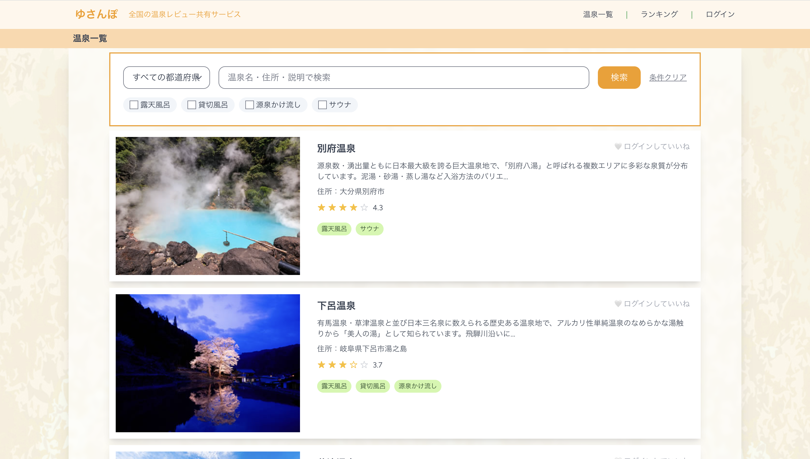
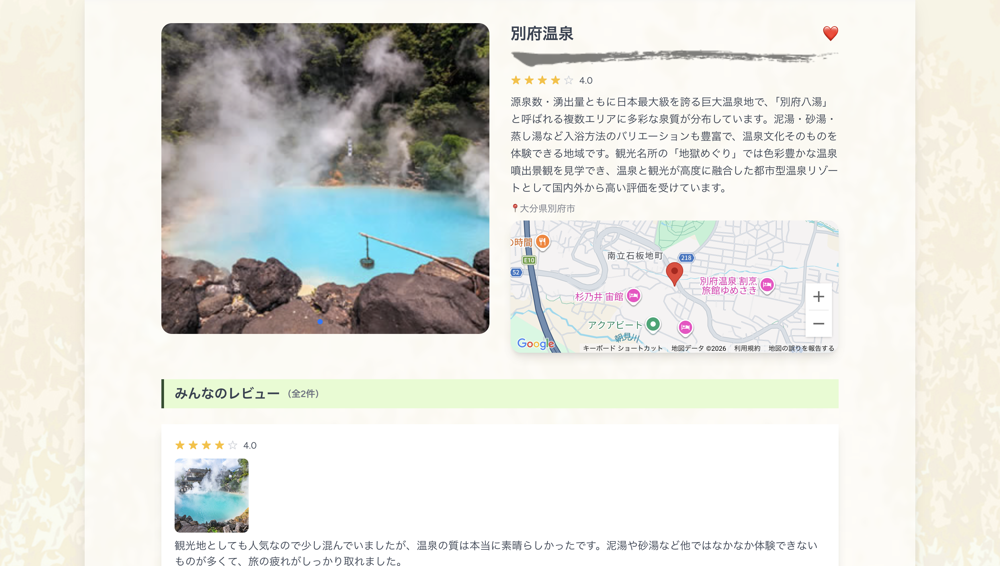
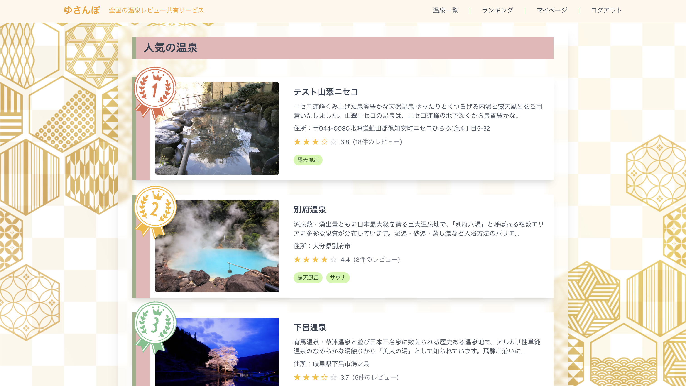
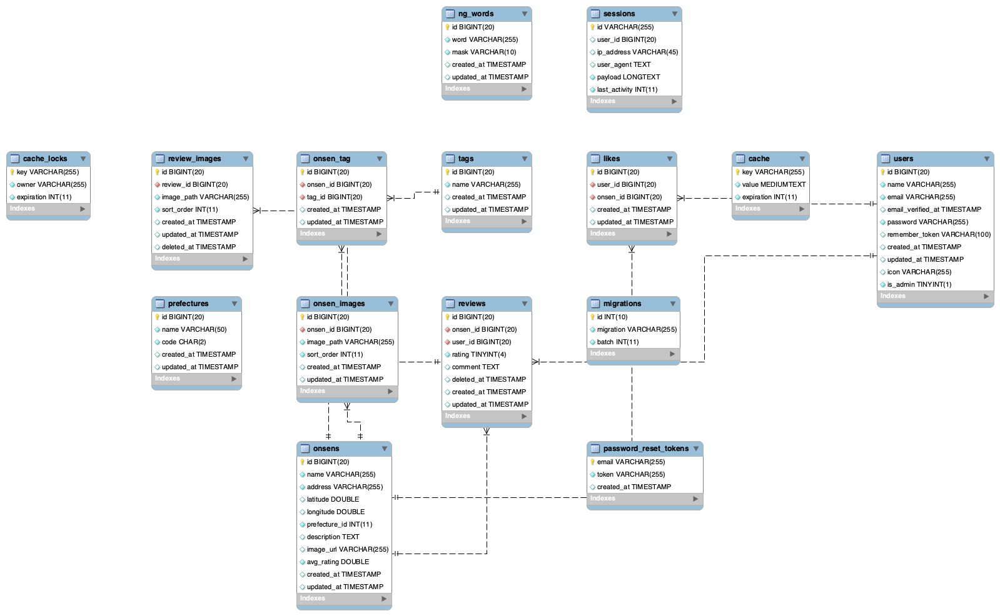

# 温泉レビューサイト（ゆさんぽ）

## 概要

温泉施設のレビューを投稿・閲覧できるWebアプリケーションです。
ユーザーが投稿した評価・コメント・画像をもとに、温泉情報を一覧・詳細・ランキング形式で確認できます。
CRUD機能に加えて検索・集計処理を実装し、実務を意識したデータ設計とパフォーマンスへの配慮を心がけました。

---
## スクリーンショット






## 開発の目的

LaravelのMVC構造やリレーショナルデータベース設計を実践的に理解するために作りました。
検索機能やランキング集計、N+1問題への対応など、実務でよく求められる実装を一通り経験することを意識しています。

---


## 主な機能

### 温泉一覧・詳細表示

温泉施設の一覧ページではレビュー数を合わせて表示しています。詳細ページでは基本情報・レビュー一覧・投稿画像を確認できます。

### レビュー投稿

評価（1〜5）・コメント・画像のアップロードに対応しています。

### マイページ

自分が投稿したレビューの一覧と履歴を確認できます。

### 検索機能

エリアの絞り込みとキーワード（部分一致）検索に対応しています。
クエリビルダで条件を動的に組み立てているので、条件の追加がしやすい構造にしています。

```php
$query = Onsen::query();

if ($request->area) {
    $query->where('area', $request->area);
}

if ($request->keyword) {
    $query->where('name', 'like', "%{$request->keyword}%");
}

$onsens = $query->paginate(10);
```

### ランキング機能

レビューの平均評価をもとに温泉をランキング表示しています。`withAvg` と `withCount` を使ってEloquentだけで集計しています。

```php
$onsens = Onsen::withCount('reviews')
    ->withAvg('reviews', 'rating')
    ->orderByDesc('reviews_avg_rating')
    ->paginate(10);
```

### ページネーション

一覧・レビューの分割表示に対応しています。

---
### 管理画面
管理者向けの画面として、温泉施設の登録・編集機能を実装しています。


## 技術スタック

フロントエンド  HTML / CSS / JavaScript /Tailwind CSS 
バックエンド 　　PHP（Laravel） 
データベース 　　MySQL 
開発環境  　　　MAMP 
バージョン管理 　Git / GitHub 

---

## 設計

### データモデル

- users（ユーザー）
- onsens（温泉）
- reviews（レビュー）
- images（画像）

レビューを中心に設計し、各テーブルとのリレーションを整理しています。

```
User hasMany Reviews
Onsen hasMany Reviews
Review belongsTo User
Review belongsTo Onsen
Review hasMany Images
```

### データ取得

N+1問題を防ぐためにEager Loadingを使用しています。

```php
Review::with(['onsen', 'images'])->latest()->paginate(5);
```

### MVC構造

ControllerはリクエストとレスポンスのみView側への受け渡しに専念し、データ取得やリレーション管理はModelに持たせるよう、責務の分離を意識しました。

---

## セキュリティ

LaravelのCSRF対策・Bladeのエスケープ処理・バリデーションによる入力チェック・ファイルアップロード制限を適用しています。

---

## 今後改善したいこと

- 並び替え機能の追加（評価順・新着順など）
- UI/UXの見直し
- インデックス設計やキャッシュの導入